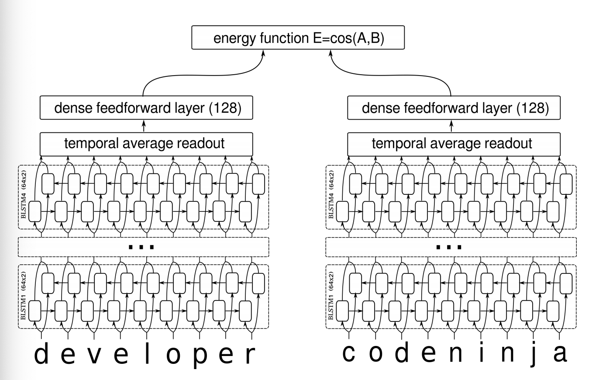
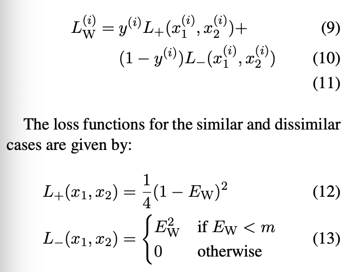

# Deep_Siamese_Text_Similarity

Learning Text Similarity with Siamese Recurrent Networks, 2016

code: https://github.com/dhwajraj/deep-siamese-text-similarity

本文根据Siamese Network网络提出了用于计算文本相似度的Siamese Recurrent Networks。

## 模型结构

Embedding层 + 4层BiLSTM(hidden size = 64) + 将每一时刻的输出取平均 + 全连接层(hidden size = 128) + 相似度计算函数(余弦相似度)

结构特点总结：
* 将Siamese Network中的Encoder换成BiLSTM
* 将距离的计算改成余弦距离
* 修改相应的loss函数：损失函数为contrastive loss function

